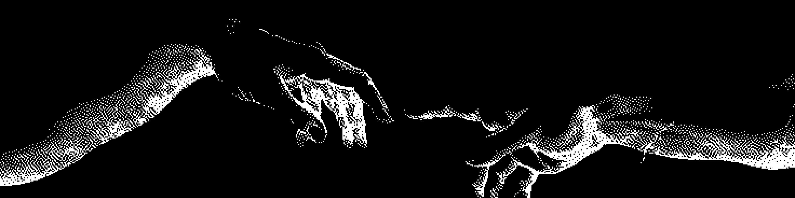

FOSS is POWER

- Undergrad CS Student @ UBB Cluj-Napoca
- passionate about permacomputing, machine learning, and process automation

#### learning and achievements
- currently learning how to train my own AI models with a focus on efficiency and portability
- built web applications that won 3x second place at ["Olimpiada Nationala de Inovatie si Creativitate Digitala"](https://infoeducatie.ro/)

#### software and hardware
- my dotfiles: [katistix/dotfiles](https://github.com/katistix/dotfiles)
    - neovim, vscode, kitty, zen browser, raycast, aerospace
- main machine: 2025 M4 Macbook Air (24GB RAM, 512GB Storage)

#### connect
- [LinkedIn: @talpaul](https://www.linkedin.com/in/talpaul)
- [Twitter (X.com): @itspaultal](https://x.com/itspaultal)
- [paultal.online](https://paultal.online)
